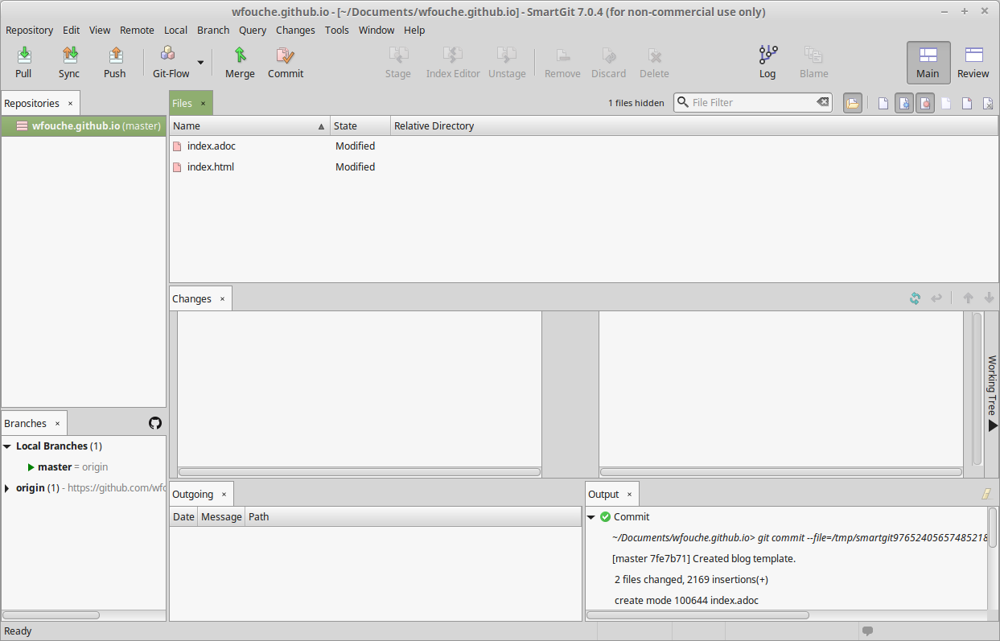
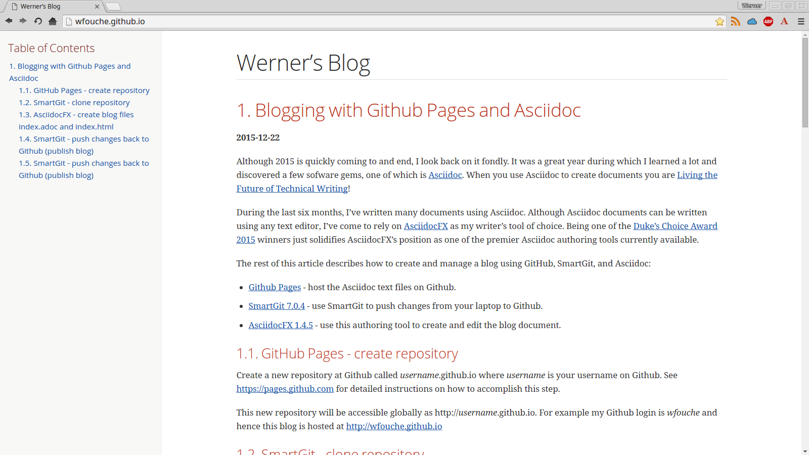

//
// file: index.adoc
//
= AsciiDoc and Github Pages
:sectnums:
:toc: left
:toclevels: 3
//:data-uri:

:toc!:

== Blogging with Github Pages and Asciidoc

*2015-12-22*

Although 2015 is quickly coming to and end, I look back on it fondly. It was a great year during which I learned a lot and discovered a few sofware gems, one of which is https://en.wikipedia.org/wiki/AsciiDoc[Asciidoc]. When you use Asciidoc to create documents you are https://medium.com/@chacon/living-the-future-of-technical-writing-2f368bd0a272#.ivrqucdon[Living the Future of Technical Writing]!

During the last six months, I've written many documents using Asciidoc. Although Asciidoc documents can be written using any text editor, I've come to rely on http://www.asciidocfx.com[AsciidocFX] as my writer's tool of choice. Being one of the https://community.oracle.com/docs/DOC-949972#wfp[Duke's Choice Award 2015] winners just solidifies AsciidocFX's position as one of the premier Asciidoc authoring tools currently available.

The rest of this article describes how to create and manage a blog using GitHub, SmartGit, and Asciidoc:

* https://pages.github.com/[Github Pages] - host the Asciidoc text files on Github.
* http://www.syntevo.com/smartgit/[SmartGit 7.0.4] - use SmartGit to push changes from your laptop to Github.
* https://github.com/asciidocfx/AsciidocFX/releases[AsciidocFX 1.4.5] - use this authoring tool to create and edit the blog document.

=== Create repository

Create a new repository at Github called __username__.github.io where _username_ is your username on Github. See https://pages.github.com for detailed instructions on how to accomplish this step.

This new repository will be accessible globally as http://__username__.github.io. For example my Github login is __wfouche__ and hence this blog is hosted at http://wfouche.github.io

=== Clone repository

SmartGit is a user-friendly front-end to Git, and can be used with Github and other Git hosting providers. SmartGit are for people who just wants to get on with the coding or editing task at hand without getting entangled in the intricacies of the Git command-line.

From the SmartGit UI, select Repository / Clone to fetch the files in the Git repository (replace *username* with your specific Github username):

* https://github.com/username/username.github.io

=== Create blog files

Create a file called *index.adoc* with AsciidocFX in the local Git folder.

----
//
// file: index.adoc
//
= Werner's Blog
:sectnums:
:toc: left
:toclevels: 3

:toc!:

== Blogging with Github Pages and Asciidoc

*2015-12-22*

Although 2015 is quickly coming to and end, I look back on it fondly. It was a great year during which I learned a lot and discovered a few sofware gems, one of which is https://en.wikipedia.org/wiki/AsciiDoc[Asciidoc]. When you use Asciidoc to create documents you are https://medium.com/@chacon/living-the-future-of-technical-writing-2f368bd0a272#.ivrqucdon[Living the Future of Technical Writing]!
----

From within AsciidocFX, click on *HTML* (top right) and then select *Save*. File *index.html* will be created in the same folder as where file *index.adoc* reside.

image::AsciidocFX.png[]

=== Publish blog

Add (Stage) files index.adoc and index.html in SmartGit and then push them to Github.

=== View blog

Go to your specific Github Pages URL (for example http://wfouche.github.io) to view your latest blog updates. File *index.html* will be displayed by default.

=== Additional information

* http://mojavelinux.github.io/decks/discover-zen-writing-asciidoc/
* http://asciidoctor.org/docs/asciidoc-writers-guide/
* http://asciidoctor.org/docs/asciidoc-syntax-quick-reference/
* https://leanpub.com/awesomeasciidoctornotebook/read
* http://asciidoctor.org/news/2014/08/21/asciidoctorj-1-5-0-released/
* https://bintray.com/asciidoctor/maven/asciidoctorj/view
* http://www.asciidocfx.com/
** http://www.asciidocfx.com/#trueplantuml-extension
** http://www.asciidocfx.com/#truejavafx-charts-extension
** http://www.asciidocfx.com/#trueditaa-extension
** https://github.com/asciidocfx/AsciidocFX/releases
* http://plantuml.com/
* http://www.graphviz.org/
* https://www.gliffy.com/
