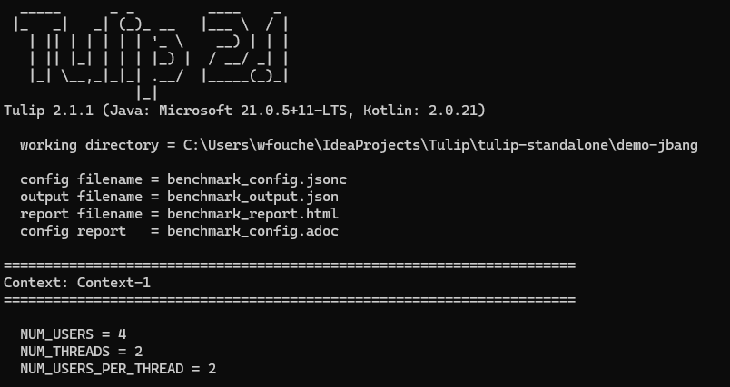
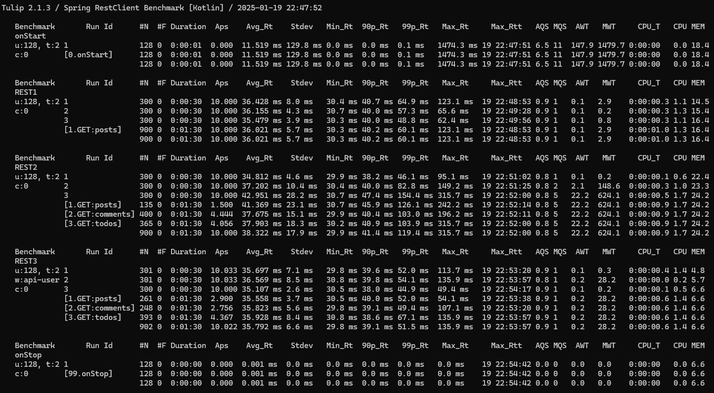
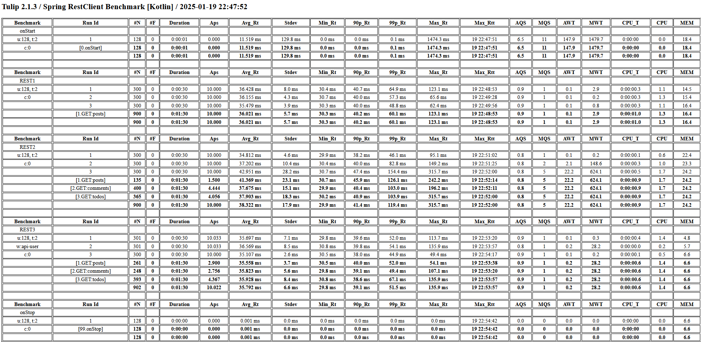

= Tulip: Load Testing, Stress Testing and Performance Regression Testing
v2.1.1
:toc: left
:sectnums:
:source-highlighter: highlightjs
:stylesdir: css
:stylesheet: adoc-foundation-potion.css

== Introduction

https://github.com/wfouche/Tulip[Tulip] is an advanced open-source software tool designed for load testing, stress testing and performance regression testing. It is a robust solution for evaluating the performance and stability of web applications under varying conditions, ensuring they can handle high traffic and stress levels efficiently. Similar to well-known tools like JMeter, Gatling and Locust, Tulip provides powerful capabilities to simulate real-world scenarios and generate comprehensive reports, helping developers identify and resolve potential bottlenecks.

== Source Code

Tulip development is hosted on Github at:

* https://github.com/wfouche/Tulip

//
// https://www.freepik.com/free-vector/tulip-flower-logo-gradient-colorful_41061958.htm
//
// logo designed by *Freepik*
//
// https://support.freepik.com/s/article/Attribution-How-when-and-where
//

== Sample Benchmark

[.stretch]
[plantuml,diag00,svg]
----
@startuml
split
   -[hidden]->
   #greenyellow:CONFIG.JSON;
split again
   -[hidden]->
   #beige:APP;
split again
   -[hidden]->
   #beige:USER.JAR;
split again
   -[hidden]->
   #azure:TULIP-RUNTIME.JAR;
end split
:EXECUTE;
#greenyellow:OUTPUT.JSON;
#cadetblue:REPORT.HTML;
@enduml
----

=== Benchmark App

.App.kt (https://www.jbang.dev/)
[source,kotlin,linenums]
----
///usr/bin/env jbang "$0" "$@" ; exit $?
//DEPS io.github.wfouche.tulip:tulip-runtime:2.1.1
//JAVA 21
//SOURCES DemoUser.kt

import io.github.wfouche.tulip.api.*

fun main(args: Array<String>) {
    TulipApi.runTulip("benchmark_config.jsonc")
}
----

=== Benchmark User Class

.DemoUser.kt
[source,kotlin,linenums]
----
import io.github.wfouche.tulip.api.TulipUser

class DemoUser(userId: Int, threadId: Int) : TulipUser(userId, threadId) {

    override fun onStart(): Boolean {
        return true
    }

    override fun action1(): Boolean {
        Thread.sleep(10)
        return true
    }

    override fun action2(): Boolean {
        Thread.sleep(20)
        return true
    }

    override fun action3(): Boolean {
        return true
    }

    override fun onStop(): Boolean {
        return true
    }
}
----

=== Run Script

.run_bench.sh
[source,bash,linenums]
----
#!/bin/bash
rm -f benchmark_report.html
export JBANG_JAVA_OPTIONS="-server -Xmx1024m -XX:+UseZGC -XX:+ZGenerational"
jbang run App.kt
echo ""
lynx -dump -width 200 benchmark_report.html
----

=== Benchmark Configuration

.benchmark_config.jsonc
[source,json,linenums]
----
{
    "actions": {
        "description": "Demo Benchmark",
        "output_filename": "benchmark_output.json",
        "report_filename": "benchmark_report.html",
        "user_class": "DemoUser",
        "user_params": {
            "url": "http://localhost:7070"
        },
        "user_actions": {
            "0": "onStart",
            "1": "DELAY-10ms",
            "2": "DELAY-20ms",
            "3": "NOP",
            "99": "onStop"
        }
    },
    "contexts": {
        "Context-1": {
            "enabled": true,
            "num_users": 4,
            "num_threads": 2
        },
        "Context-2": {
            "enabled": false,
            "num_users": 4,
            "num_threads": 4
        }
    },
    "benchmarks": {
        "Startup": {
            "actions": [
                {
                    "id": 0
                }
            ]
        },
        "Maximum Rate": {
            "time": {
                "pre_warmup_duration": 5,
                "warmup_duration": 10,
                "benchmark_duration": 30,
                "benchmark_repeat_count": 3
            },
            "throughput_rate": 0.0,
            "actions": [
                {
                    "id": 1,
                    "weight": 90
                },
                {
                    "id": 2,
                    "weight": 10
                }
            ]
        },
        "Fixed Rate": {
            "time": {
                "pre_warmup_duration": 5,
                "warmup_duration": 10,
                "benchmark_duration": 30,
                "benchmark_repeat_count": 3
            },
            "throughput_rate": 100.0,
            "actions": [
                {
                    "id": 1,
                    "weight": 90
                },
                {
                    "id": 2,
                    "weight": 10
                }
            ]
        },
        "NOP": {
            "time": {
                "pre_warmup_duration": 5,
                "warmup_duration": 10,
                "benchmark_duration": 30,
                "benchmark_repeat_count": 3
            },
            "throughput_rate": 0.0,
            "actions": [
                {
                    "id": 3
                }
            ]
        },
        "Shutdown": {
            "actions": [
                {
                    "id": 99
                }
            ]
        }
    }
}
----

=== Console Output

This is the information that Tulip writes to the console when starting up after method TulipApi.runTulip() was called.

=== Performance Report - Console

=== Performance Report - Browser

== Basic Principles

<Under construction.>

== Quick Start Guide

<Under construction.>

== Tulip Releases

* [v2.1.1] - 2025-01-09

** https://github.com/wfouche/Tulip/releases?q=v2.1.1&expanded=true

* [v2.1.0] - 2025-01-06

** https://github.com/wfouche/Tulip/releases?q=v2.1.0&expanded=true

* [v2.0.3] - 2024-12-19

** https://github.com/wfouche/Tulip/releases?q=v2.0.3&expanded=true

* [v2.0.2] - 2024-12-15

** https://github.com/wfouche/Tulip/releases?q=v2.0.2&expanded=true

* [v2.0.1] - 2024/12/08

** https://github.com/wfouche/Tulip/releases?q=v2.0.1&expanded=true

* [v2.0.0] - 2024/12/01

** https://github.com/wfouche/Tulip/releases?q=v2.0.0&expanded=true

// Links

// https://github.com/errata-ai/vale

// https://redhat-documentation.github.io/vale-at-red-hat/docs/main/user-guide/asciidoc-style-for-vale/

[appendix]
== License

[source,text]
----
Copyright 2024 Werner Fouché

Licensed under the Apache License, Version 2.0 (the "License");
you may not use this file except in compliance with the License.
You may obtain a copy of the License at

    http://www.apache.org/licenses/LICENSE-2.0

Unless required by applicable law or agreed to in writing, software
distributed under the License is distributed on an "AS IS" BASIS,
WITHOUT WARRANTIES OR CONDITIONS OF ANY KIND, either express or implied.
See the License for the specific language governing permissions and
limitations under the License.
----