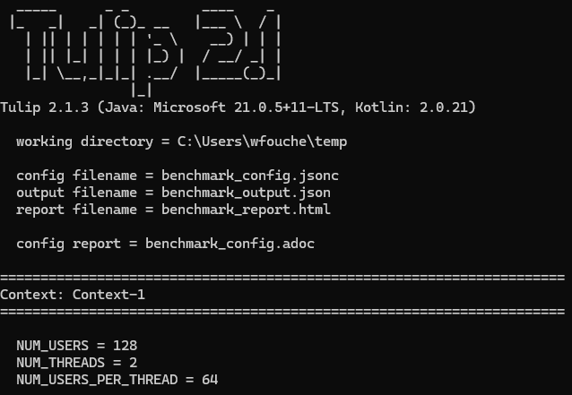

= Tulip: Load Testing, Stress Testing and Performance Regression Testing
v2.1.3
:toc: left
:sectnums:
:source-highlighter: highlightjs
:stylesdir: css
:stylesheet: adoc-foundation-potion.css

[cols="1a"]
|===
|
image::tulip_logo.svg[width=128]
https://github.com/wfouche/Tulip
|===

== Introduction

https://github.com/wfouche/Tulip[Tulip] is an advanced open-source software tool, written in Kotlin for the JVM, designed for load testing, stress testing and performance regression testing. It is a robust solution for evaluating the performance and stability of web applications under varying conditions, ensuring they can handle high traffic and stress levels efficiently. Similar to well-known tools like JMeter, Gatling and Locust, Tulip provides powerful capabilities to simulate real-world scenarios and generate comprehensive reports, helping developers identify and resolve potential bottlenecks.

Tulip is available as a runtime JAR on Maven Central. A benchmark program is consists of three parts:

. JSONC benchmark configuration file specifying benchmark scenarios
. User class that implement actions to be benchmarked
. App class that activates the Tulip runtime

[plantuml,diag00,svg]
----
@startuml
split
   -[hidden]->
   #greenyellow:benchmark_config.jsonc;
split again
   -[hidden]->
   #beige:App.class;
split again
   -[hidden]->
   #beige:User.class;
split again
   -[hidden]->
   #azure:tulip-runtime.jar;
end split
:EXECUTE;
#greenyellow:benchmark_output.json;
#cadetblue:benchmark_report.html;
@enduml
----

[source,xml]
----
<!-- https://mvnrepository.com/artifact/io.github.wfouche.tulip/tulip-runtime -->
<dependency>
    <groupId>io.github.wfouche.tulip</groupId>
    <artifactId>tulip-runtime</artifactId>
    <version>2.1.3</version>
</dependency>
----

== Quick Start Guide

[cols="1a"]
|===
|
"Seeing is believing and believing is knowing and knowing beats unknowing and the unknown."
-- Philip Roth
|===

The best and quickest way to get started with Tulip is to try out the sample benchmark program.

Prerequisites::
* OpenJDK 21 or later version is installed
* https://www.jbang.dev/[JBang] 0.121.0 or later version is installed
* [optional] Scala-cli is installed to run the Scala sample benchmark program
* Tulip has been tested and works on Linux, Windows or MacOS

Run the following command to create the Kotlin version of the sample benchmark program:

`jbang io.github.wfouche.tulip:tulip-runtime:2.1.3 Kotlin`

[NOTE]
====
The sample benchmark program is implemented in four languages:

* Java
* Groovy
* Kotlin
* Scala

For example, to generate the Java version of the benchmark program simply run command:

`jbang io.github.wfouche.tulip:tulip-runtime:2.1.3 Java`
====

Thereafter start script `./run_bench.sh` (Linux or MacOS) or `.\run_bench.cmd` (Windows).

While the benchmark program is running the `benchmark_output.json` file is incrementally updated with benchmark results, and once benchmark is finished a benchmark report is generated from the benchmark output.

The benchmark report file is called `benchmark_report.html`

//
// https://www.freepik.com/free-vector/tulip-flower-logo-gradient-colorful_41061958.htm
//
// logo designed by *Freepik*
//
// https://support.freepik.com/s/article/Attribution-How-when-and-where
//

== Sample Benchmark

=== Benchmark App

.App.kt
[source,kotlin,linenums]
----
include::sample/App.kt[]
----

=== Benchmark User Class

.HttpUser.kt
[source,kotlin,linenums]
----
include::sample/HttpUser.kt[]
----

=== Run Script

.run_bench.sh
[source,bash,linenums]
----
include::sample/run_bench.sh[]
----

.run_bench.cmd
[source,bash,linenums]
----
include::sample/run_bench.cmd[]
----

=== Benchmark Configuration

.benchmark_config.jsonc
[source,json,linenums]
----
include::sample/benchmark_config.jsonc[]
----

=== Console Output

This is the information that Tulip writes to the console when initializing after method TulipApi.runTulip() was called.

=== Performance Report - Console

image::images/image-tulip-report-1.png[]

=== Performance Report - Browser

image::images/image-tulip-report-2.png[]

== Basic Principles

<Under construction.>

// Links

// https://github.com/errata-ai/vale

// https://redhat-documentation.github.io/vale-at-red-hat/docs/main/user-guide/asciidoc-style-for-vale/

[appendix]
== License

[source,text]
----
Copyright 2024 Werner Fouché

Licensed under the Apache License, Version 2.0 (the "License");
you may not use this file except in compliance with the License.
You may obtain a copy of the License at

    http://www.apache.org/licenses/LICENSE-2.0

Unless required by applicable law or agreed to in writing, software
distributed under the License is distributed on an "AS IS" BASIS,
WITHOUT WARRANTIES OR CONDITIONS OF ANY KIND, either express or implied.
See the License for the specific language governing permissions and
limitations under the License.
----