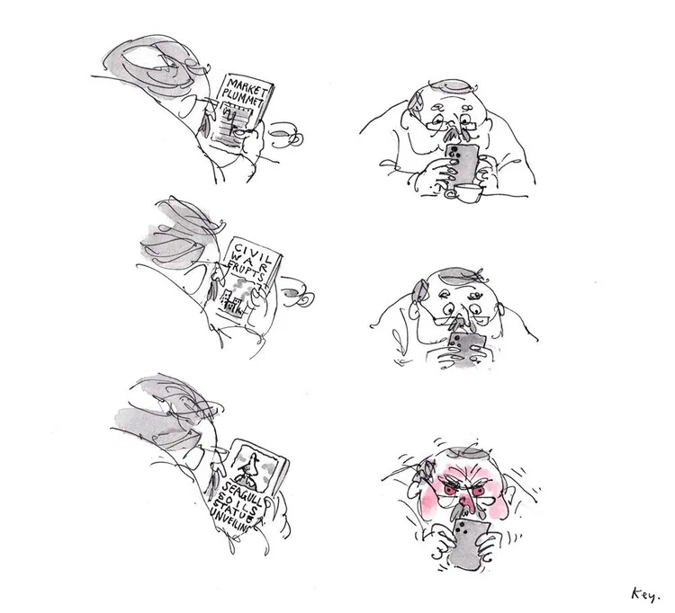
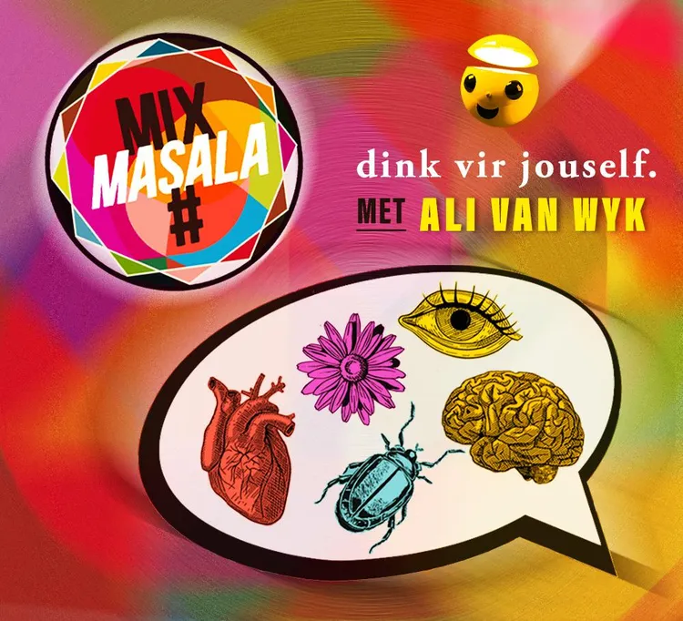
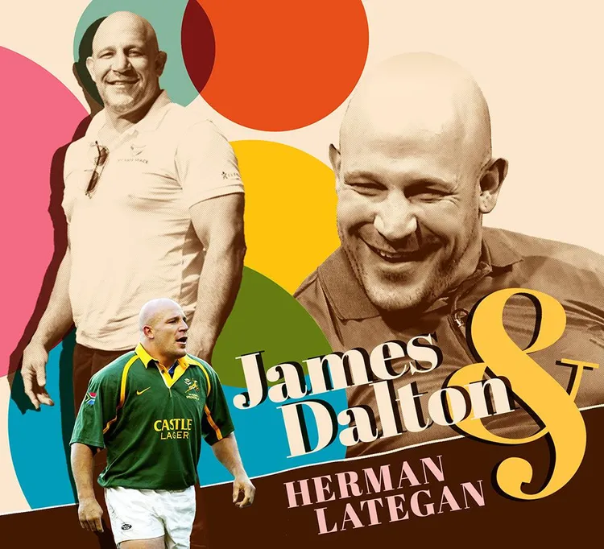
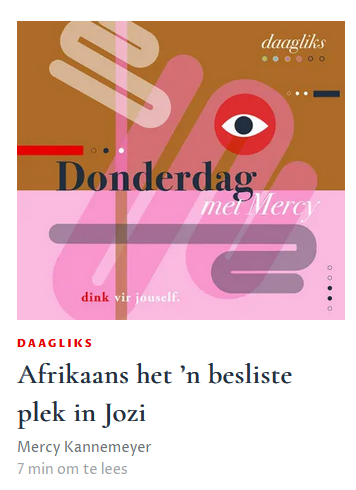

= 13 Desember 2024
:toc: left
:sectnums:
:stylesdir: css
:stylesheet: adoc-foundation.css

== Nuus & Politiek

=== Die Catch-22 van die DA / RNE

[link=https://www.vryeweekblad.com/nuus-en-politiek/2024-12-13-die-catch-22-van-die-da-in-die-rne/]

Ramaphosa se sterkste vennoot se tande is getrek ná Solidariteit se lomp poging om die taalstryd in skole te kaap.

=== Nuwe ondersoek na Hani-sluipmoord kan politieke bom word

=== Bokke te koop: ’n Stertjie vir jou?

=== Só het Kamala Harris se veldtog skeefgeloop

== Humor

== Vrye Denker

=== Die nuus wat klap soos ’n 13de tjek

Jy kan maar weet die familie is op pad om jou kalkoen, gerookte ham en koekstruif te kom verorber, en daarvoor het jy spesiale sielstempering nodig. ALI VAN WYK help om die wapenrusting van lighartigheid, dikvelligheid en humor gereed te kry.

[link=https://www.vryeweekblad.com/menings-en-debat/2024-12-13-die-nuus-wat-klap-soos-n-13de-tjek/]

=== Die one & only Bullet pyl ’n nuwe rigting in

Laas Vrydag was die oudrugbyheld James ‘Bullet’ Dalton presies een jaar nugter en skoon. HERMAN LATEGAN het hom tydens sy hoenderkopdae skramsweg leer ken. Hy is verbluf oor die nuwe mens voor hom – wat nou ’n organisasie vir die beskerming van kinders teen geweld, My Safe Place, bestuur.

[link=https://www.vryeweekblad.com/menings-en-debat/2024-12-13-die-one-only-bullet-pyl-n-nuwe-rigting-in/]

3.3 Ens.

== Boeke

...

== Agterblad

== Die week se geselsbriewe

=== Maandag

=== Dinsdag

=== Woensdag

=== Donderdag

[link=https://www.vryeweekblad.com/bulletins/2024-12-12-afrikaans-het-n-besliste-plek-in-jozi/]

